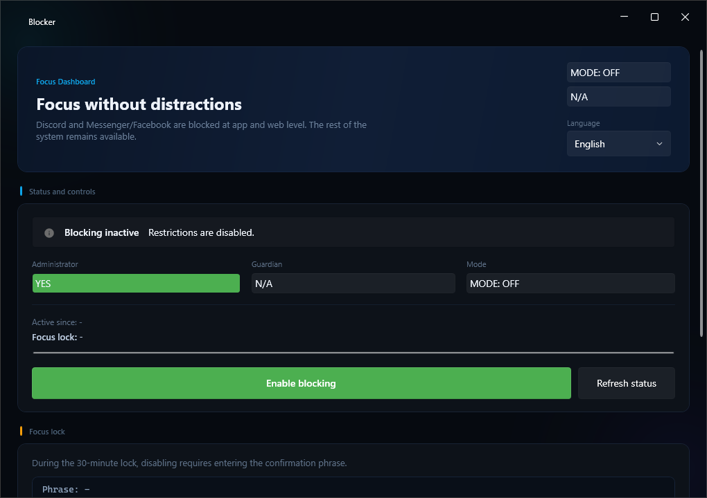
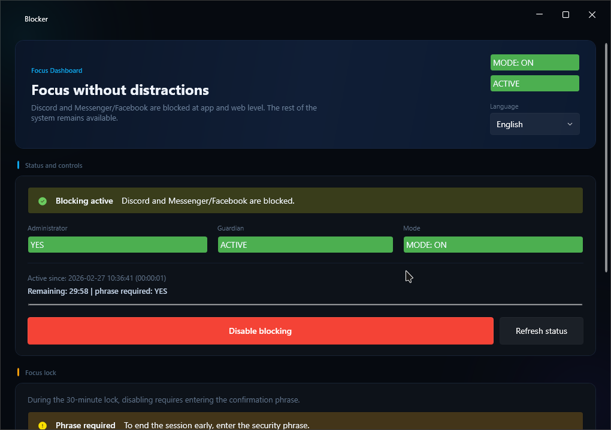
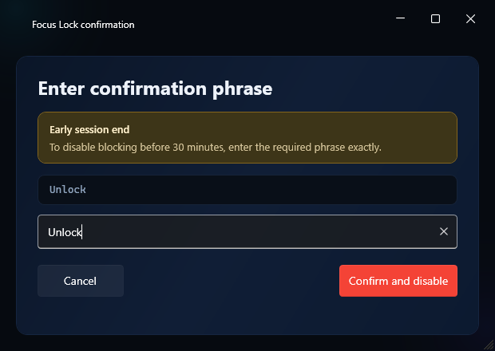
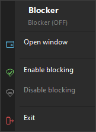

<h1 align="center">Blocker</h1>

<p align="center">
  A Windows desktop app that blocks distracting applications and websites at the system level so you can stay focused.
</p>

<p align="center">
  <a href="https://github.com/11ArkaN/Blocker/actions/workflows/build.yml"></a>
  <a href="https://github.com/11ArkaN/Blocker/releases/latest"></a>
  <a href="LICENSE"></a>
</p>

---

## What It Does

Blocker enforces distraction-free work sessions by simultaneously:

- **Blocking executables via Windows Firewall** — outbound & inbound rules for Discord, Messenger, and Facebook desktop apps
- **Blocking domains via the hosts file** — redirects Discord, Facebook, and Messenger domains to `0.0.0.0`
- **Killing & watching processes** — terminates target processes on enable and continuously prevents re-launch
- **Guardian process** — a companion process that restarts Blocker if it gets killed during an active session
- **Focus Lock** — a configurable cool-down period (default 30 min) that requires typing a confirmation phrase to disable early

All changes are **fully reversible** — disabling blocking restores firewall rules, hosts file, and process state.

## Screenshots

<p align="center">
  
  &nbsp;&nbsp;
  
</p>

<p align="center">
  
  &nbsp;&nbsp;
  
</p>

## Features

| Feature | Description |
|---|---|
| **Firewall blocking** | Creates per-executable block rules via `New-NetFirewallRule` |
| **Hosts file blocking** | Adds managed `# BEGIN BlockerApp` / `# END BlockerApp` section |
| **Process watchdog** | Polls every 2 seconds and kills blocked processes |
| **Guardian process** | Separate `Blocker.Guardian.exe` monitors the main app PID |
| **Focus Lock** | 30-minute lock with progress bar; early disable requires typing a phrase |
| **Session-based unlock phrase** | Set a custom phrase each time you enable blocking |
| **System tray** | Minimize to tray, quick enable/disable, styled dark context menu |
| **Auto-start** | Registers in `HKCU\...\Run` to launch minimized on boot |
| **Localization** | Polish and English, switchable at runtime |
| **Crash recovery** | Detects unclean shutdown and restores access on next launch |
| **Dark UI** | Modern Fluent design using [WPF-UI](https://github.com/lepoco/wpfui) |

## Requirements

- **Windows 10** or later
- [**.NET 9 Desktop Runtime**](https://dotnet.microsoft.com/download/dotnet/9.0) (or use the self-contained release)
- **Administrator privileges** (required for firewall rules and hosts file access)

## Installation

### Download a Release

1. Go to [**Releases**](../../releases/latest)
2. Download one of:
   - `Blocker-vX.Y.Z-win-x64.zip` — self-contained, no .NET install needed
   - `Blocker-vX.Y.Z-framework-dependent.zip` — smaller, requires .NET 9 Desktop Runtime
3. Extract and run `Blocker.App.exe` as administrator

### Build from Source

```bash
git clone https://github.com/11ArkaN/Blocker.git
cd Blocker
dotnet build Blocker.sln --configuration Release
```

The output will be in `src/Blocker.App/bin/Release/net9.0-windows/`.

## Architecture

```
Blocker.sln
├── src/
│   ├── Blocker.App/           # WPF application (main UI + all services)
│   │   ├── Constants/         # App-wide constants
│   │   ├── Contracts/         # Service interfaces
│   │   ├── Models/            # Data models
│   │   ├── Services/          # Service implementations
│   │   └── ViewModels/        # MVVM view models
│   └── Blocker.Guardian/      # Standalone guardian process
```

| Component | Purpose |
|---|---|
| `BlockOrchestrator` | Coordinates enable/disable across all providers |
| `FirewallProgramBlockingProvider` | Manages Windows Firewall rules via PowerShell |
| `HostsBlockingProvider` | Manages the system hosts file |
| `ProcessWatchdogService` | Background loop that kills blocked processes |
| `GuardianService` | Launches and manages the guardian companion process |
| `FocusLockService` | Computes lock windows and validates unlock phrases |
| `TrayService` | System tray icon with styled context menu |

## Data & Logs

| Path | Content |
|---|---|
| `%ProgramData%\Blocker\state.json` | Persisted session state |
| `%ProgramData%\Blocker\localization.json` | Language preference |
| `%ProgramData%\Blocker\logs\app.log` | Application log (rotated at 5 MB, 3 archives) |
| `%ProgramData%\Blocker\guardian\` | Guardian stop-signal files |

## Contributing

See [CONTRIBUTING.md](CONTRIBUTING.md) for guidelines.

## Security

See [SECURITY.md](SECURITY.md) for the security policy and responsible disclosure process.

## License

[MIT](LICENSE)
